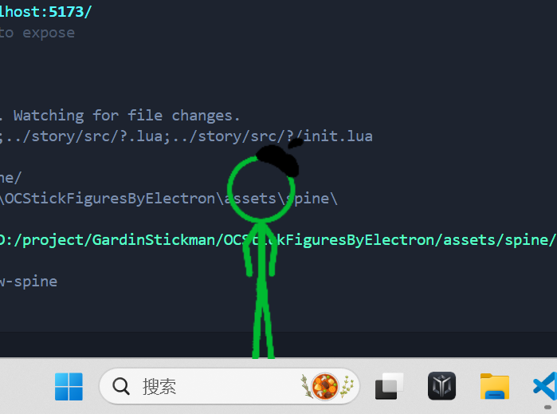

# OCStickFiguresEngine

基于 Electron + TypeScript + Vite + PixiJSv6 + pixi-spine ，需要Spine 3.8 model
[官方文档](https://gardin233.github.io/SFBE-docs/)

## 为什么我要做这个？

我喜欢 Alan Becker 的火柴人系列，尽管我一点动画美工不会，但是用代码我也可以实现自己的火柴人在自己屏幕上跳上跳下!不过，我只是个普通的学生，所以我基本上是边学边做的，所以可能会发现许多AI代码，大佬们轻点喷😭

展示的Spine模型采用的是我的oc，我对动画还需要学习很多......

看起来还行，是吧（？）

## 当前的项目结构

```plaintext
├── external                # 操作 WinAPI 的外部程序
├── externalResource        # 外部程序源码 
├── story                   # 可编辑脚本存放处  
│
├── src                     # Electron 程序位置
│   ├── client              # 用户逻辑存放处
│   │   ├── character       # 角色
│   │   ├── ipc             # 通信监听封装
│   │   └── utils           # 方法
│   │
│   ├── server              # 后台逻辑
│   │   ├── Async           # 异步函数封装
│   │   ├── ipc             # 通信监听封装
│   │   ├── process         # 运行过程中需要持久的程序
│   │   ├── StoryLoader         # 控制故事
│   │   └── utils           # 方法
│   │
│   └── types               # 类型
│
```
